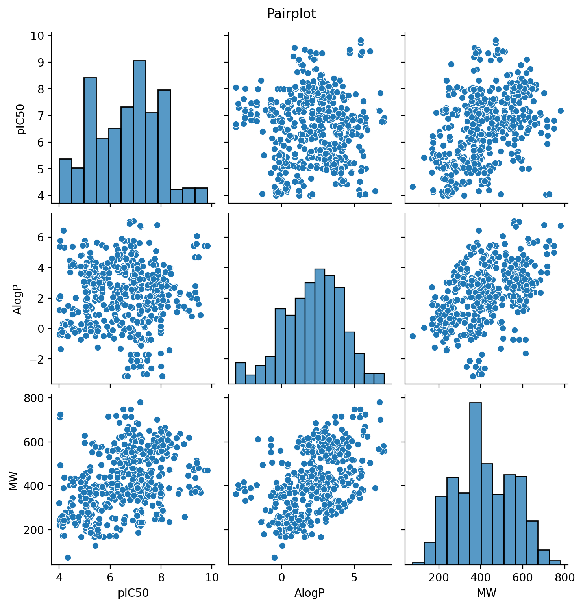
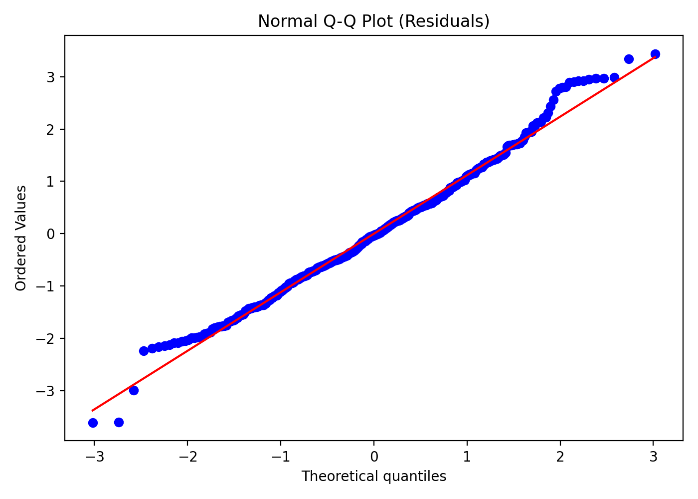

# Improving CAII pIC50 baselines (ChEMBL205): multivariate and extended linear models

This repository is a direct continuation of **Project 1 (AlogP-only OLS baseline)**:  
➡️ **Project 1 repo:** https://github.com/Epitectus2223/chembl-ca2-pic50-alogp

In Project 1, we established an honest baseline and showed that **AlogP alone** carries no useful linear signal for predicting **CAII pIC50**. Here, we build on that baseline and run two follow-up experiments on the same curated CAII dataset (**n = 543**) to test whether adding information and mild transformations improves explanatory power:

- **P2:** Multivariate OLS using **AlogP + Molecular Weight (MW)**
- **P2.1:** Extended linear models using **log(MW)** and **quadratic terms** (A/B/C model comparison)

**Key takeaway:** Adding MW and simple transformations improves fit versus the AlogP-only baseline, but **heteroscedasticity and influential observations persist**, motivating robust and/or non-linear approaches next.

---

## Summary

---

## P2 — Multivariate OLS (AlogP + MW)

### Model
**OLS:** `pIC50 ~ AlogP + MW`

### Results (key metrics)
- **R² ≈ 0.242** | **Adjusted R² ≈ 0.240**
- **F-statistic = 86.41 (p < 0.001)** → model is statistically significant overall
- Coefficients (direction of effects):
  - Intercept ≈ **4.82**
  - **AlogP ≈ -0.156** (negative contribution)
  - **MW ≈ 0.0051** (positive contribution)

### Diagnostics (what mattered)
- **Multicollinearity:** VIF(AlogP) ≈ **1.25** → no problematic collinearity
- **Heteroscedasticity:** Breusch–Pagan p ≈ **0.005** → significant heteroscedasticity
- **Influential points:** **16 observations** with Cook’s Distance > 4/n → influential compounds affect the fit
- Residual plots show mild structure → possible non-linearity + heteroscedasticity

---

## P2.1 — Extended linear models (log / quadratic terms)

This sub-study evaluates whether simple transformations can capture mild non-linear effects without moving to full ML.

### Models tested
- **Model A:** `pIC50 ~ AlogP + log(MW)`
- **Model B:** `pIC50 ~ AlogP + log(MW) + MW² (standardized)`
- **Model C:** `pIC50 ~ AlogP + log(MW) + AlogP² (standardized)`

### Results (comparison)
- **R² / Adjusted R²**
  - **A:** 0.264 / 0.262
  - **B:** 0.267 / 0.263
  - **C:** 0.271 / 0.267  ← best overall

- **New terms significance**
  - **B:** MW² term p = 0.149 (not significant)
  - **C:** AlogP² term p = 0.031 (significant)

### Diagnostics (trade-offs)
- **Heteroscedasticity persists:** Breusch–Pagan p < 0.01 for all A/B/C
- **Multicollinearity (VIF):**
  - **A:** acceptable (~1.2)
  - **B:** very high (~7.3) → unstable coefficients
  - **C:** moderate (~3.1) → manageable
- **Influential points (Cook’s Distance):**
  - **A:** 15 | **B:** 20 | **C:** 18 influential observations
- **Best trade-off:** **Model C** (highest adjusted R² + significant quadratic term, moderate VIF)

---

## Recommendations
- Treat **P2 (AlogP + MW)** as a stronger linear baseline than AlogP-only, but **do not rely on it for high-stakes prediction** due to heteroscedasticity and influential points.
- If staying within “linear + simple transforms”, prefer **Model C** from P2.1 (best fit with manageable collinearity).
- Next steps (highest impact):
  1. **Robust inference:** heteroscedasticity-consistent standard errors (e.g., HC3) or robust regression
  2. **Modeling under heteroscedasticity:** consider weighted least squares (WLS)
  3. **Expand descriptors:** add polarity / H-bonding descriptors (TPSA, HBD/HBA, etc.)
  4. **Non-linear models:** RF/SVM/GAM once the feature set is richer
  5. **Validation:** report out-of-sample performance (CV); for chemical generalization consider scaffold splits

---

## Key plots P2
**Pairplot**  

**Normal Q–Q plot (residuals)**  

**Cook’s Distance (influence)**  

---

## Key plots P2.1
> Add your model-comparison and diagnostic plots in `figures/` and link them here.

- Model comparison (A vs B vs C) — R² / Adj R² summary  
  figures/p21_model_comparison.png

- Residuals vs fitted (Model C)  
  figures/p21_modelC_residuals_vs_fitted.png

- Q–Q plot (Model C)  
  figures/p21_modelC_qqplot.png

- VIF summary (A/B/C)  
  figures/p21_vif_summary.png

---

## Data note
1. Download bioactivity records from **ChEMBL** for target **CHEMBL205 (CAII)**.
2. Filter to **IC50 (nM)** with relation "=" and organism *Homo sapiens*.
3. Deduplicate records and compute/select descriptors **AlogP** and **MW**.
4. Build the final curated table (n = 543 in this study).

---

## Technical process
- Data curation (filters + deduplication)
- Feature engineering:
  - P2: AlogP, MW
  - P2.1: log(MW), MW² (std), AlogP² (std)
- Modeling:
  - OLS for P2
  - OLS for A/B/C in P2.1
- Diagnostics:
  - Residual analysis, Q–Q plots
  - Breusch–Pagan for heteroscedasticity
  - VIF for multicollinearity
  - Cook’s Distance for influence

---

## Tools used
- **Python**: `pandas`, `statsmodels`, `matplotlib`, `scipy`
- **R**: `lm()`, `tidyverse`
- **Excel**: regression sanity checks
- **ChEMBL**: bioactivity data source

---

## Author
M. Osvaldo Hernández Montoya

